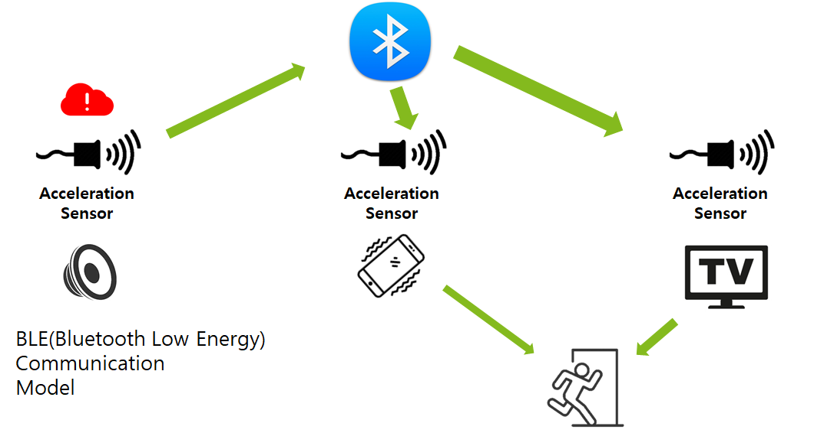

# Earthquake detection and response platform development for customized earthquake response

## Notice
***Due to the nature of the project, security is important, so we do not disclose the code.***

## Contents

○ Device development for earthquake detection and response
   -We intend to develop a platform that propagates response methods appropriate to the situation in case of an earthquake by using the popular seismic motion alarm developed through the industry-academic project in the first semester of 2018.

○ Develop a situation-aware earthquake response service and build a test bed
  -Development of an earthquake response platform that identifies the user's location in the event of an earthquake, collects information on surrounding conditions, and propagates response methods

* Development of earthquake response plan using location information: Developing an algorithm that calculates and propagates the optimal response route using the user's location information.

 * Establish an active earthquake response service environment using a system based on a home network and radio waves to respond to the level of shaking through a smartphone, smart watch, speaker, etc.

## System architecture

1) When the popular seismic motion alarm detects an earthquake, it transmits the earthquake motion information to the Android smartphone through Wi-Fi. 

2) After that, a pop-up message and a voice message about the earthquake occurrence and countermeasures are executed on the Android smartphone, and at the same time, it is transmitted to the Raspberry Pi using BLE communication.
3) The Raspberry Pi is connected to a display device, stops the video being played, and propagates earthquakes and countermeasures through pictures and voice messages.

 

## Result
  
- Development of lightweight earthquake detection algorithm using various neural network techniques

 - To rewrite the existing earthquake detection algorithm using various neural networks (CNN, RNN, ANN, etc.) and classification techniques, compare the performance and precision of each technique, and apply it to the earthquake early warning system based on various small devices developed earlier. Developing an optimal algorithm.
